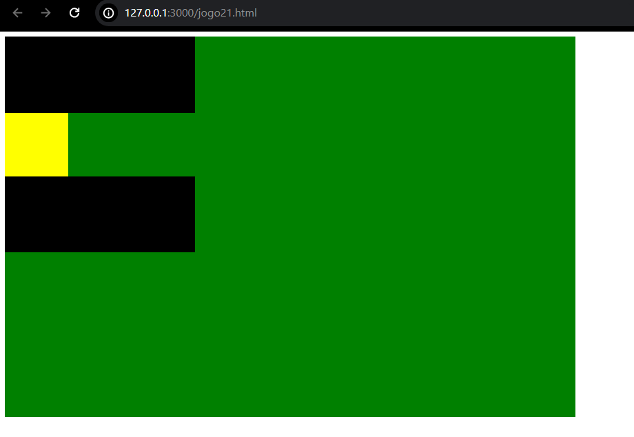
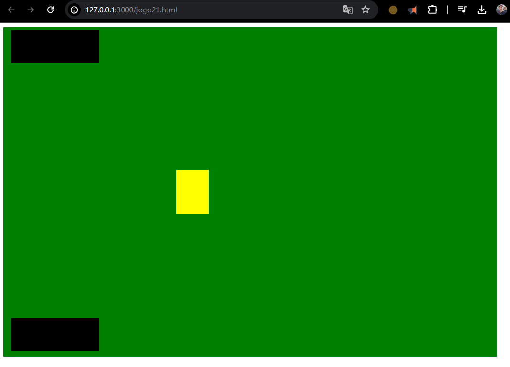

# Resultado
### (algo próximo disto)



isto para primeira parte em seguida o resultado com reposicionamento dos itens.

com o reposicionamento e ajuste tamanho  deve ficar parecido como abaixo:



<hr>

Agora vamos focar no estudo de como foi escrito o nosso CSS. (vejamos abaixo):

``` css
.mesa{ // Defina div mesa
    position: fixed; // Posição fixada
    width:900px; // Largura de 900px
    height:600px; // Altura de 600px
    background-color: green; // Cor de fundo verde
      }
.robot{  // Defina div robot
   position: relative; // posição relativa
   top:5px; // distância de 5px em relação ao topo
   left:15px; // Distância de 15px da esquerda
   width:160px; // Largura de 160px
   height:60px; // Altura de 60px
   background-color: black; // Cor de fundo preto  }      
.jogador{ // Defina div jogador
    position: relative; // posição relativa
    top:390px; // Distância de 390px em relção ao topo
    left:15px; // Distância de 15px da esquerda
    width:160px; // Largura de 160px
    height:60px; // Altura de 60px
    background-color: black; // Cor de fundo preto }   
.baralho{ // Defina div baralho
    position: relative; // Posição relativa
    top:200px; // Distância de 200px em relação ao topo
    left:315px; // Distância de 315px da esquerda
    width:60px; // Largura de 60px
    height:80px; // Altura de 80px
    background-color:yellow;}   // Cor de fundo amarela
```
